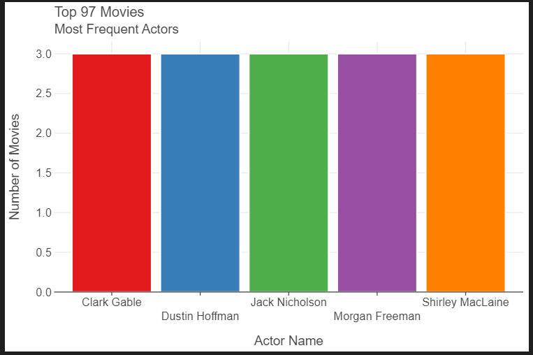

# Analysis of the Top 97 Movies on Rotten Tomatoes

## Introduction

This project analyzes the top 97 movies according to Rotten Tomatoes. The analysis aims to understand the distribution of ratings, the release years, actors involved, and other interesting patterns.

## Data Collection

The data was collected from various sources and compiled into three CSV files:
- `actors_list.csv`: Contains the list of actors with their IDs.
- `top_mov_actors.csv`: Contains the mapping of movies to actors.
- `top_movie.csv`: Contains the details of the top movies including their ranks, titles, release years, and ratings.

## Data Analysis

### 1. Distribution of Ratings

The Rotten Tomatoes ratings for the top 97 movies were analyzed to understand their distribution. Below is a summary of the key statistics:

- **Mean Rating:** 88.76%
- **Median Rating:** 92.00%
- **Standard Deviation:** 10.59%
- **Minimum Rating:** 42%
- **Maximum Rating:** 99%

### 2. Year of Release Analysis

The distribution of the years of release for the top 97 movies shows how the spread of top-rated movies spans different decades:

### 3. Actor Analysis

An analysis of the actors appearing in the top 97 movies reveals interesting patterns. Here are some key statistics:

- **Total Unique Actors:** 340
- **Most Frequent Actor:** Shirley MacLaine, Dustin Hoffman, Morgan Freeman, Clark Gable and Jack Nicholson (appeared in 3 movies)

### 4. Top 10 Movies

Here are the top 10 movies from the list, along with their Rotten Tomatoes ratings:

| Rank | Title                          | Year | Rating |
|------|--------------------------------|------|--------|
| #1   | Parasite                       | 2019 | 99%    |
| #2   | Casablanca                     | 1942 | 99%    |
| #3   | All About Eve                  | 1950 | 99%    |
| #4   | On the Waterfront              | 1954 | 99%    |
| #5   | Moonlight                      | 2016 | 98%    |
| #6   | Schindler's List               | 1993 | 98%    |
| #7   | It Happened One Night          | 1934 | 98%    |
| #8   | Rebecca                        | 1940 | 98%    |
| #9   | All Quiet on the Western Front | 1930 | 98%    |
| #10  | Sunrise                        | 1927 | 98%    |

## Conclusion

This analysis provides insights into the top-rated movies according to Rotten Tomatoes. The majority of these movies have very high ratings, reflecting their critical acclaim. The release years and actors also show a diverse range of movies, indicating that top-rated movies span across different times and include a variety of talents.

## Repository Structure

- `data/raw/`: Contains the dataset used for the analysis.
- `docs/figures/`: Contains the visualizations used in this markdown file.
- `notebooks/`: Contains the scripts used for data collection and analysis.
- `README.md`: This markdown file.

## How to Run the Analysis

To replicate the analysis:
1. Clone the repository.
2. Navigate to the `notebooks/` directory.
3. Run the data collection and analysis scripts as per the instructions in the `README.md` file.

